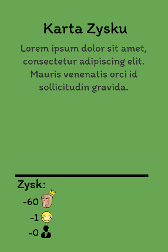

# CardMaker
Program that makes card graphics for board game from .txt files

# How to use it

Simply create .txt file with one card data in each line:

card_type|pointsAmount|pointsAmount|pointsAmount|pointsAmount|pointsAmount|pointsAmount|description_of_card

For example this line:
 
zsk|-60|-1|-0|||| Lorem ipsum dolor sit amet, consectetur adipiscing elit. Mauris venenatis orci id sollicitudin gravida.
 
Will give this card:
 

# Card types
Each type of card has his own color and graphic. The board game I created this program for is in polish so you have that kind of types:
 
plc - Policja (police) 
pol - Polityczna (political) 
prz - Przekręt(scam) 
zsk - Zysk(revenue) 
crb - Choroba (sickness) 
szk - Szkoda (detriment) 
prc - Praca(job) 
tcz - Teczka (briefcase) 
cba - CBA (anti-corruption agency) 
szw - Szwindel (fraud) 
str - Strata (loss) 
kor - Korzysć(benefit) 
gow - Dziecko (child) 
